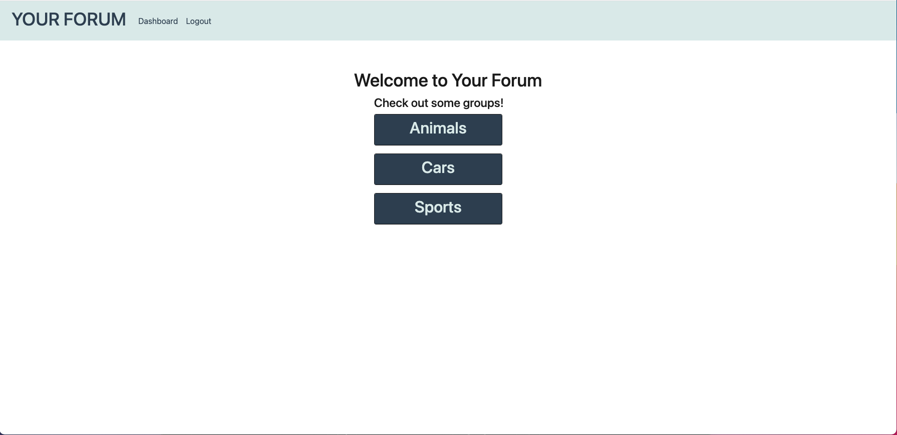

# Group Project 2

## Table of Contents
  
1. [Description](#description)
2. [Installation](#installation)
3. [Usage](#usage)
4. [License](#license)
5. [Contributing Guidelines](#contributing-guidelines)
6. [Test Instructions](#test-instructions)
7. [Questions](#questions)
  
## Description

* A public discussion forum where the user in charge of the experience.
  
## Installation

* Clone the repository, install dependencies using command "npm i", then start server using command "npm start"

## Usage

## License
  
* MIT
  
## Contributing Guidelines

* Fork the repository, commit contributions, then create a pull request.

## Test Instructions

* Fork the repository, create tests, then submit an issue.
  
## Questions

* Contact information for questions:

* https://github.com/MichaelHermes
* https://github.com/troyat88
* https://github.com/newengood

  
  